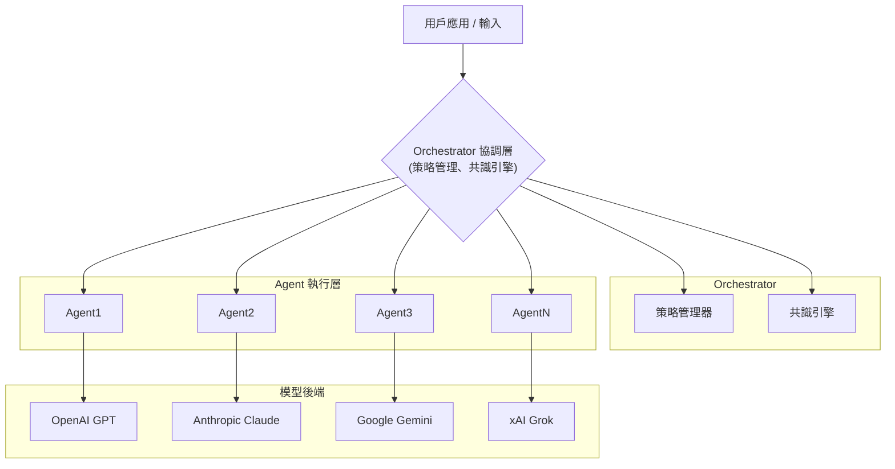

# MassGen Deep Research Report（Gemini Deep Research）

> 來源：Gemini Deep Research 產出
> 整理日期：2026-03-18

---

# 執行摘要

MassGen 是由前 AutoGen（現 AG2）創始人王馳（Chi Wang）及其團隊於 2025 年推出的開源**多代理協作框架**，目標在於透過「並行學習小組」方式集結多個大語言模型（LLM）之力，解決複雜任務。與單一智能體相比，MassGen 讓多個代理（可使用不同模型如 OpenAI GPT、Anthropic Claude、Google Gemini、xAI Grok 等）**同步啟動並行推理**，相互觀察並投票達成共識，再由票數最高者作為最終回答，提升品質與可靠度。其核心創新包括跨模型協同、非同步並行協作、透明審計（可視化 agent 辯論與快照）等。

本報告針對 MassGen 所有機制與實作細節進行全面盤點，涵蓋系統架構與模組責任、核心演算法、資料與標註流程、效能指標、安全與可解釋性、部署運維、與類似工具比較，以及實作建議與路線圖等。

---

# MassGen 背景與定位

**來源與作者**：MassGen 為開源項目，由王馳（DeepMind 資深研究員、AutoGen/AG2 創始人）領導開發。官方文件註明 MassGen 為「面向生成式 AI 的多代理擴展系統」（Multi-Agent Scaling System for GenAI），靈感來自 xAI 的 Grok Heavy、DeepMind 的 Gemini Deep Think 等先進並行系統。王馳曾於 2025 年 8 月在 Berkeley Agentic AI 峰會與 9 月於 Columbia 大學研討會介紹 MassGen，指出該系統可支援數十個協作代理並帶來顯著性能提升。

**發表時間與目的**：MassGen 於 2025 下半年陸續公開（GitHub 0.0.3 起步，至 2025 年 11 月發布 v0.1.12 版本）。其主要用途在於研究和開發多代理協同解題的框架：系統將用戶任務指派給多個 AI 代理，讓它們**並行思考**、**交換意見**，最終**達成自然共識**以產生高品質答案。官方強調 MassGen 能「模仿專家小組討論」，避免單一模型能力瓶頸。MassGen 以 Apache 2.0 開源授權發布，可在 Terminal、CLI、Web UI 或 API 模式下使用。

---

# 系統架構與模組職責

MassGen 採三層架構：**Orchestrator**（協調層）、**Agents**（代理執行層）、**Backend Abstraction**（模型後端層）。



**數據輸入**：用戶通過 CLI 或 API 提交任務描述或問題（Prompt）。Orchestrator 讀取輸入並初始化交互上下文，可能同時載入**專案上下文路徑**（context paths）以供讀寫。

**預處理**：Orchestrator 解析 YAML 設定檔，配置多個 Agent。每個 Agent 可指定不同後端類型（例如 OpenAI API、Claude API、LiteLLM 本地模型等）及工具（MCP 工具包、文件操作等）。若需要使用工具，如 Web 搜尋或資料庫查詢，Orchestrator 會透過 MCP（Model Context Protocol）整合外部工具。

**模型架構**：MassGen 本身不訓練新模型，而是**匯聚多個預訓練 LLM**。代理層（Agent Layer）可使用不同模型（如 GPT-5、Claude Sonnet、Gemini Pro、Grok-4 等），並可配置模型相關參數（系統提示、令牌限制等）。每個 Agent 在獨立子程序或線程中運行，透過 Backend 抽象層與真實模型互動。Backend 抽象層統一接口，支援本地推理器（如 vLLM、LiteLLM）與雲端 API。

**推論流程**：Orchestrator 依設定啟動多個 Agent。各 Agent 同步或同時向各自選定的 LLM 提交任務。過程中，代理間會即時**觀察對方最新回答並進行交流**：每輪迭代，Agent 可以選擇**新增答案**或**對現有答案投票**。若有代理提交新答案，Orchestrator 會透過「**注入繼續（inject-and-continue）**」機制將此答案注入其他代理的工作流，避免重啟整個推理並保存原始思路。

**協作共識**：Agents 持續多輪投票，直到**所有代理都完成投票**為止。最終票數最高的答案即為"贏家"，由該 Agent 報告為最終結果。這種**多模型並行+投票機制**不依賴強制一致，實現自然收斂到最可信答案。

**後處理**：Orchestrator 收集最終答案後，可進行格式化或文件輸出。MassGen 還會將每輪對話與回答**保存到檔案系統**中：每個 Agent 有獨立工作目錄（`workspaces/agentX`），每提交答案時會在 `snapshots/` 目錄生成快照，並將整個會話記錄於 `sessions/` 目錄。用戶可透過 CLI 查看原始答案、投票過程和工作區內容，或使用 `massgen export` 生成分享鏈結。

**部署與運行**：MassGen 支援多種運行模式：CLI（`uv run massgen`）、TUI、瀏覽器 Web UI、OpenAI 相容的 HTTP API 伺服器（預設監聽 4000 端口）。

**監控與回饋**：系統執行時自動產生日誌與度量。`massgen logs` 指令查看歷史紀錄，包括使用成本、輸入問題等。Orchestrator 監測崩潰並自動重新嘗試。所有會話和快照可回溯審計。

---

# 核心演算法與技術細節

**代理協同模式**：每位 Agent 在執行時保持獨立思考，並共享觀察結果。採用**多輪迭代投票**：每輪由所有 Agent 分析後決定新增回答或對既有回答投票。當所有 Agent 完成投票後，票數最高的答案即被選定。

**投票機制與注入（Inject-and-Continue）**：一般情況下，每輪都讓所有代理執行任務：若有代理 A 提出新答案，其他代理在下一輪能立即「看到」該新答案並據此更新思路，而不用重啟代理已有進度。MassGen 保留了代理每一輪的中間結果快照，並將新資訊動態注入持續運算過程中，大幅減少重算浪費。

**後端抽象與混合**：Backend 抽象層將不同提供者統一接口，可並行使用多種模型；支援跨平台串接（OpenAI、Anthropic、Google、xAI 及各種本地模型如 LiteLLM、vLLM）。系統內建與 MCP 整合的能力，使代理能使用網路服務、資料庫、文件系統等工具。MassGen 還支援透過容器（Docker）進行複雜任務自動化，如同時操控 Claude+Gemini 環境。

**記憶體管理**：
- 每次執行的對話歷程存為「Turn」，整個多代理會話保存在 `sessions/`
- 在多輪互動模式（Interactive Mode）下，可保持上下文連續
- **永久記憶**：最新版本已引入基於向量檢索的「**記憶 MCP**」模組，將對話和知識以 Markdown、向量形式**跨代理共享**
- 當上下文接近限制時，MassGen 會自動執行**漸進式壓縮**：將過往對話摘要後裁剪並持久保存，確保不丟失關鍵線索

---

# 資料管線與標註策略

MassGen 主要面向即時互動任務，不包含傳統的訓練資料管線。

- **資料來源**：輸入資料即是用戶提出的任務描述與上下文文檔，系統本身無自動爬取外部訓練資料。
- **隱私與合規**：官方文件建議將敏感文件置於**保護路徑**（Protected Paths），禁止任何代理讀寫，以防外洩。多代理系統更需注意**情報擴散**風險。在企業部署時，建議符合 GDPR/CCPA 等法規。

---

# 性能指標與評估方法

**成本與延遲**：N 個代理並行時的 API 呼叫量是單代理的 N 倍，**推論成本**上升明顯。**延遲**取決於慢速代理的響應、網路狀況與投票輪數。

**準確度與質量**：MassGen 無固定「準確度」指標，因任務性質多元。官方引用內部基準表示**多代理協作可帶來統計上顯著提升**。

**A/B 測試**：對比單一模型輸入 vs 多模型 MassGen 輸出，讓標註者評分。若部署在企業系統，也可在線上進行 A/B 實驗。

---

# 安全性、偏誤與可解釋性

**攻擊面**：惡意輸入可能誘導多個代理形成集體錯誤決策；代理之間的資訊共享機制若未加保護，也可能被利用（如注入有害指令到其他代理）。建議對代理輸入進行內容過濾，並限制代理操作。

**偏誤緩解**：可在配置中**混搭不同背景的模型**並監控輸出結果，或在 Orchestrator 加入去偏邏輯（由專門的過濾代理進行最終審查）。

**可解釋性工具**：運行後可透過 CLI 的代理選擇菜單逐一檢視每個代理的原始回答及投票歷程。系統也會產生 JSON 格式的元資料（`massgen_metadata`）包含每次回答的分數、投票情況與權重。

---

# 與類似工具比較表

| 工具/框架 | 架構類型 | 性能特徵 | 易用性 | 可擴展性 | 授權 |
|---------|---------|--------|------|---------|------|
| **MassGen** | 多代理 Orchestrator-Agent（並行+投票共識） | 支援多模型並行推理，基於投票的自然收斂，但成本與延遲較高 | CLI/WebUI，入門有學習曲線 | 模組化，支援多 LLM 後端、MCP 工具 | Apache 2.0 |
| **AG2/AutoGen** | 多代理對話式框架 | 倡導透過對話與工具合作完成子任務 | 深度可定制，學習曲線較陡 | 高，可自訂技能、集成第三方框架 | Apache 2.0 |
| **LLM Council** | 靜態「諮詢委員會」模式（依序審閱） | 分階段：獨立回答→互評→主席綜合 | Web 前端易用，流程固定 | 一次性集成，缺乏持久會話機制 | MIT |
| **LangGraph** | Agent-Workflow 框架（嵌入式於 LangChain） | 著重工作流和記憶管理，原生流式輸出 | 熟悉 LangChain 則體驗佳 | 高度可擴展，面向大型產品級應用 | MIT |
| **CrewAI** | 精簡自主多代理框架 | 強調順序或層級流程執行，適合企業自動化 | YAML 和程式化 API，入門適中 | 可自主選擇算法，活躍社群與商業支持 | MIT |

---

# 實作建議與工程路線圖

### 短期目標（0–3 個月）
- 核心架構搭建：Orchestrator + Agent 基礎架構，多模型並行調用
- 配置系統：YAML/JSON，指定代理、模型、投票規則
- 投票與共識算法：基於票數的共識機制，預設 `max_new_answers_per_agent` 和 `max_new_answers_global` 上限
- 本地部署：使用 LiteLLM 或 vLLM 降低初期成本

### 中期目標（3–6 個月）
- 多模型與工具整合：MCP 插件（Web 搜索、程序執行、資料庫查詢）
- 監控與日誌：詳細日誌系統，`logs` 指令行工具
- CI/CD & 部署管道：自動化流程，容器化（Docker/K8s）

### 長期目標（6–12 個月）
- 增強協作策略：自適應投票閥值、分層協作
- 自動化工具與 UI：Web 或桌面介面，即時可視化
- 評估與優化：標準評估集，定期 A/B 測試

---

# 程式碼範例與使用指引

**多代理啟動 (CLI)**：
```bash
uv run massgen --config @examples/basic/multi/three_agents_default "Analyze the pros and cons of renewable energy"
```

**範例配置 (YAML)**：
```yaml
agents:
  - id: "agent1"
    backend:
      type: "openai"
      model: "openrouter/openai/gpt-5"
  - id: "agent2"
    backend:
      type: "anthropic"
      model: "claude-sonnet-4.5"
```

**記錄與結果查看**：
```bash
massgen logs
massgen logs list
massgen export
```

**HTTP 服務端部署**：
```bash
uv run massgen serve --config @examples/basic/multi/three_agents_default
```
伺服器啟動後，對 `/v1/chat/completions` 的 POST 請求將由 MassGen 處理，返回包含協作結果的 ChatCompletion 響應。
